# Running (and coding with) Local AI on a Mac
This is a comprehensive guide on how to run AI models and coding agents locally on a Mac. I gathered various bits and pieces of information scattered across the internet into a single resource. If you have a spare Mac lying around, you can turn it into an “LLM server” and use it instead of paying for OpenAI, Claude, etc.

You’ll need a decent amount of RAM for this to work. Around 32GB is where things start getting interesting. I’m currently running 30B-class models with the same 128K context window as OpenAI Codex on an M3 MacBook Pro with 36GB of RAM — all locally.

> ⚠️ This guide assumes familiarity with LLM concepts, inference engines, and basic system configuration. It is a good starting point for anyone who is building local AI systems or is experimenting with agent worflows.

## Why?
Because it works — and surprisingly well. But more importantly: there are cost and privacy benefits of running AI locally.

The architecture of Apple’s M-series chips suits this type of workload. AI models benefit from GPUs with access to large amounts of memory. Macs, with their unified memory architecture — where GPU cores can access nearly all available RAM — become a viable alternative to consumer GPUs (which often ship with much less memory). Even NVIDIA has started moving in this direction with systems like [DGX Spark](https://www.nvidia.com/en-us/products/workstations/dgx-spark/). 

Standalone GPUs still have more raw compute throughput, to set expectations correctly. But for many advanced workflows, Apple Silicon is a great alternative environment.

## Table of contents
- [Part I - Architecture Decisions](#part-i---architecture-decisions)
  - [Inference Engines](#inference-engines)
  - [LLM API Servers](#llm-api-servers)
    - [Practical Recommendations](#practical-recommendations)
  - [Models](#models)
    - [Model Types](#model-types)
    - [Recommended Models](#recommended-models)
    - [Quantization](#quantization)
    - [Configuring VRAM](#configuring-vram)
- [Part II - Running Models](#part-ii--running-models)
  - [Installing LM Studio](#installing-lm-studio)
  - [Installing llama.cpp](#installing-llamacpp)
  - [Downloading and Running Models](#downloading-and-running-models)
    - [With LM Studio](#with-lm-studio)
    - [With llama.cpp](#with-llamacpp)
  - [Config Settings](#config-settings)
    - [Context Window](#context-window)
    - [Sampling Settings](#sampling-settings)
    - [Thinking Mode](#thinking-mode)
    - [Flash Attention](#flash-attention)
    - [Prompt Cache](#prompt-cache)
- [Part III - Agentic Workflows](#part-iii--agentic-workflows)
  - [Configuring API Servers](#configuring-api-servers)
    - [Context Window for Agents](#context-window-for-agents)
    - [Parallel Requests](#parallel-requests)
    - [Tool Calling](#tool-calling)
    - [Starting API Server](#starting-api-servers)
  - [Installing and Configuring Coding Agents](#installing-and-configuring-coding-agents)
    - [OpenCode](#opencode)
    - [Claude Code](#claude-code)
  - [Loading Models Dynamically](#loading-models-dynamically)
- [Closing Thoughts](#closing-thoughts)

# Part I - Architecture Decisions
***Before installing anything, it helps to understand the architectural building blocks: model formats, inference engines, quantization, and memory trade-offs. These decisions determine everything that follows.***

This is a very simple diagram of all the components we'll be looking at:

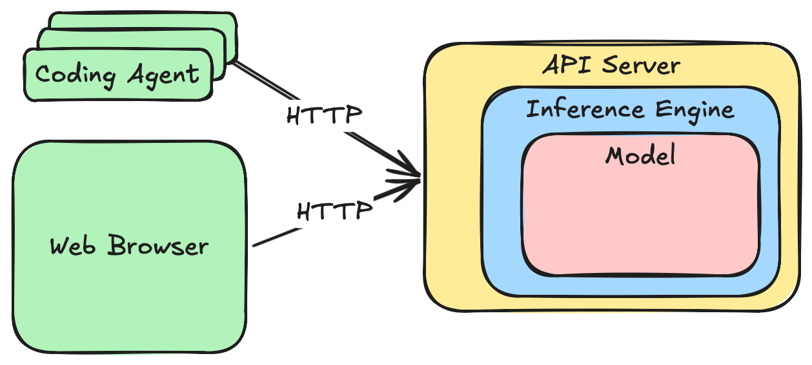

## Inference Engines
An AI model, for the most part, is just a huge collection of numbers - the so-called "model weights". **Inference Engine** is where the actual linear algebra operations on the model weights happen when a model generates tokens. As of right now, there's no built-in general-purpose inference engine in MacOS, but there are free and/or open-source Mac inference engine implementations:

 - [MLX-LM](https://github.com/ml-explore/mlx-lm) - developed by Apple and is highly optimized for Apple silicon. It is build around [Metal API](https://en.wikipedia.org/wiki/Metal_(API)) and gives the fastest straight-up token generation of any engine I tried.
 - [llama.cpp](https://github.com/ggml-org/llama.cpp) - a cross-platform engine, and as a result is not as highly optimized for Apple hardware as MLX is despite using the same Metal API (it is about 20%-30% slower on token generation for the same model on the same hardware).

MLX-LM development feels somewhat sluggish, usually a month or two behind the current State of the Art (SOTA) models and performance optimization algorithms. llama.cpp has a much faster pace of development and feels like a very mature product overall. It tends to support new SOTA models and optimization techniques earlier, often working out of the box or with parameter adjustments that MLX may not yet expose.

If you've used AI models before, you might know [HuggingFace Transformers](https://huggingface.co/docs/transformers/en/index), but it's primarily for research and not as fast or memory-efficient as the two above.

***In short: MLX gives you peak Apple-optimized throughput; llama.cpp gives you flexibility, faster feature adoption, and broader model support.***

## LLM API Servers
Inference engine is just the first part in the overall local AI setup. To interact with a model - either through a web interface or for coding tools and agents to call an LLM via APIs - it needs to be wrapped in an LLM API server. Both MLX-LM and llama.cpp come with such capabilities, but:
 - MLX-LM is a very-very limited LLM server. In fact, it doesn't even have a web UI, and doesn't have a Claude Code compatible API endpoint.
 - llama.cpp is a pretty decent LLM API server and can absolutely be used as-is.
 - [LM Studio](https://lmstudio.ai) is an alternative to MLX-LM. It uses some bits and pieces of MLX-LM engine internally, thus it offers the same Apple-optimized performance, as a desktop app (or as a "headless" server). It even supports llama.cpp as an alternative backend engine, but I don't really see any practical use for this feature given that llama.cpp itself is a pretty good API server.

There's also [Ollama](https://ollama.com), which is an LLM API server as well built on top of llama.cpp. It has a nice interface and it is really easy to configure the coding tools to use with it, but it significantly reduces the flexibility and configurability of llama.cpp to achieve that ease of use, to the point of being pretty much unusable for SOTA models. For that reason I won't be focusing on it at all here.

### Practical Recommendations
Install both LM Studio and llama.cpp. There's practically no cost associated with having both installed, and even having them running at the same time, assuming the models are loaded dynamically.

The logic for choosing which one to use might go like this:
1. If the model you want to use, as well as its performance optimizations, are fully supported by LM Studio, go with it. The performance advantage of the Apple silicon optimized solution is totally worth it.
2. If the model you want to use is not yet supported by LM Studio, or there is a setting or a performance optimization trick you can only get with llama.cpp, go with llama.cpp.

***With that architectural foundation in place, the next question becomes: what models should you actually run?***

## Models
With each new generation of open-source/open-weight models released they're getting smaller and, at the same time, smarter, and it now feels like we can get something useful out of them on our consumer hardware. The main "metric" which defines how smart a model potentially is, and how much memory and processing power it needs, is the **number of parameters**, or number of weights, which can range from less than a billion to more than a trillion. Number of parameters is usually mentioned next to the model name (i.e. `Qwen3.5-27B` means that it is a 27 billion parameter model).

### Model Types
There are two main types of models right now:
 - **Dense** models - all parameters participate in token generation. This is the type assumed by default if nothing else is specified.
 - **Sparse** or **Mixture of Experts (MoE)** models - only some weights (active parameters) are used per token. They usually have the number of active parameters appended to their name. For example, `Qwen3.5-35B-A3B` is a 35B **total** parameter model, but only 3B of those are used to generate the next token. Which specific ones (the "experts" for this token) is dynamically decided by the model itself.

For both types the **total** number of parameters translates directly into **memory requirements**, but the processing power required depends more on the number of **active** parameters. Since for dense models all parameters are active, similarly sized MoE models are significantly faster while at the same time being equally capable or even better.

### Model Formats
There are two formats supported by the recommended inference engines:
 
 - MLX - Mac-specific model format (usually designated with "MLX" name or  logo).
 - GGUF - llama.cpp model format created specifically for this engine, supports more advanced models and faster loading.

LM Studio supports models in both formats (because it supports both inference engines). llama.cpp supports GGUF format only.

### Recommended Models
Medium-size models (~20-30B parameters) fit into higher tier consumer hardware and are getting good enough for practical usage. Here are some examples:
 - [Qwen3.5-35B-A3B](https://huggingface.co/Qwen/Qwen3.5-35B-A3B) - 35 billion parameter Mixture of Experts model with 3 billion active parameters
 - [Qwen3.5-27B](https://huggingface.co/Qwen/Qwen3.5-27B) - 27 billion parameter dense model
 - [GLM-4.7-Flash](https://huggingface.co/zai-org/GLM-4.7-Flash) - 30 billion parameter Mixture of Experts model, 3 billion active parameters

The links above point to the "canonical" versions of these models - the so-called "model cards". They contain a lot of useful information about the models, and even have links to download them, but only in the "canonical" [Safetensors](https://huggingface.co/docs/safetensors/index) format which is not directly usable with the inference engines discussed here.

After a model is released in the "canonical" format, it gets converted to more usable MLX and GGUF versions by the open-source community. And since with the right tool pretty much anyone can do it, a lot of people and organizations publish their own versions of the same model. It's a little bit of a "wild west" out there with so many variations available to download. How to find the right one? I'd suggest looking into "official" (if there's such a thing in the open-source world) communities:
 - MLX versions of the models are released by [MLX Org community on HiggingFace](https://huggingface.co/mlx-community). Alternatively, [LM Studio community](https://huggingface.co/lmstudio-community) releases some MLX models as well, usually suffixed with `"-MLX"` after the model name.
 - For GGUF models the best community to grab the models from is [Unsloth](https://huggingface.co/unsloth). Some of the models are also converted to GGUF and released by [ggml-org](https://huggingface.co/ggml-org) (the org behind llama.cpp) and LM Studio (similarly to their MLX models, postfixed with `"-GGUF"`), but these communities are less active and less organized comparing to Unsloth.

***Which brings us to one of the most important practical topics in local AI: quantization.***

### Quantization
The "canonical" models downloadable from the model cards usually have their weights represented by high-precision [bfloat16](https://en.wikipedia.org/wiki/Bfloat16_floating-point_format) data type (stands for "brain floating point" 🤯, developed by Google Brain group), an AI-frendlier version of 16-bit float. This data type gives best fidelity, but the models are large and inference is slow. In this format the recommended models are ~60GB each just for weights (~30B × 16 bits) and require significantly more at runtime due to various caches and buffers. Realistically, a 96GB of RAM is needed to run comfortably at that precision.

To reduce size and speed up inference, models can be converted to a lower-resolution data type at the cost of some generation quality (accuracy) loss - the process called **quantization**. An intuitive analogy is the precision of **π**: sometimes you need high precision, i.e. `3.1415926535...`, but `3.14` is often good enough. Of course, the actual quantization algorithms used to produce the quantized models are more sophisticated than just rounding the number, but the analogy still serves for illustrative purposes. If you're interested in the specific algorithms and approaches I recommend watching [this video](https://youtu.be/qoQJq5UwV1c?si=oJuztkwQV8th0GF-) which explains it really well.

General rules of thumb for quality loss:
 - **Q8(8-bit)**: less than 1% loss in accuracy, practically indistinguishable from 16-bit, but only about half the size of the original model
 - **Q6(6-bit)** and **Q5(5-bit)**: minimal loss, very close to 16-bit, ~1/3 of the original model size
 - **Q4(4-bit)**: standard for local use, between 1% and 5% loss in accuracy, at roughly 1/4 size of the original model
 - **Q3(3-bit) and below**: noticeable degradation

The number after **Q** corresponds to the number of "Bits per Weight (BPW)" for the majority of the model weights. Some of the model weights may still be at the original resolution, or quantized to a higher-precision type than the overall model, but it is a small portion of the overall model weights and it doesn't affect the value after **Q**. MLX models usually available for download at all these quantization levels.

GGUF models started with the same quantization approach, but since then moved to [Unsloth Dynamic](https://unsloth.ai/docs/basics/unsloth-dynamic-2.0-ggufs) quantization mechanism. Effective (BPW) is higher with this mechanism than with the more straightforward one used by MLX, resulting in "fractional" quants.

The table below compares MLX "whole" quants to GGUF "fractional" quants and approximates their BPW and size reduction. You can see that the higher-tier GGUF quants behave closer to the next MLX quant tier while remaining slightly smaller:

| MLX quant   | GGUF quant  | Effective BPW | Size as % of BF16 |
| ----------- | ----------- | ------------- | ----------------- |
| 4-bit (Q4)  | Q4_0        | 4             | ~25-27%           |
|             | Q4_K_S      | ~4.25-4.35    | ~26-27%           |
|             | Q4_K_M      | ~4.50-4.65    | ~28-30%           |
|             | Q4_K_XL     | ~4.80-5.20    | ~29-32%           |
| 5-bit (Q5)  | Q5_0        | 5             | ~31-33%           |
|             | Q5_K_S      | ~5.25-5.35    | ~32-33%           |
|             | Q5_K_M      | ~5.50-5.65    | ~33-35%           |
|             | Q5_K_XL     | ~6+           | ~34-37%           |
| 6-bit (Q6)  | Q6_0        | 6             | ~37-40%           |
|             | Q6_K        | ~6.5          | ~38-42%           |
|             | Q6_K_XL     | ~6.7-7.2      | ~40-44%           |
| 8-bit (Q8)  | Q8_0        | 8             | ~50%              |

Practical guidance:
 - If you can run a 4-bit version, you're in a good spot already, even if it is the best your system can do. It's ~4x smaller with minor accuracy loss.
 - GGUF `Q4_K_M` is the "Q4.5 sweet spot" for llama.cpp.
 - If you have more RAM, try 5-bit or 6-bit versions (higher-tier quants for GGUF models). At these quantization levels models are barely distinguishable from the original.
 - If you have enough RAM for 16-bit, great. But consider a quantized larger model instead - you can run a ~3-4x larger model at reasonable quantization, which may give you noticeably better results.

A useful heuristic:
> Model file size should be ~60% of the amount of your RAM for useful results. With 32GB RAM you can run ~20GB disk size models.

> :bulb: **Tip:** You can see model file sizes and fit estimates in LM Studio's model browser for both GGUF and MLX models:
<br>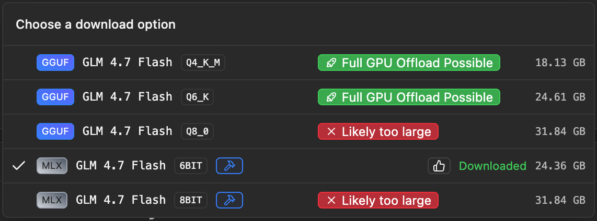

### Configuring VRAM
Inference runs significantly faster when models use GPU cores instead of CPU cores, requiring them to reside in VRAM. Even though Macs have "Unified Memory", GPUs can only use some of it as VRAM.
> :bulb: **Tip: Checking the amount of VRAM on your Mac**<br>
> In LM Studio, click the "App Settings" gear icon  in the bottom left corner, navigate to the "Hardware" tab, and you'll see the available VRAM in the "Memory Capacity" section:<br>
> 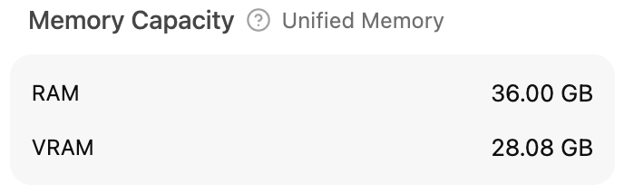

The default VRAM setting Macs come with is too low. To increase it, run:
```
sudo sysctl iogpu.wired_limit_mb=<XXX>
```
Where `XXX` is the memory in MBs to allow as VRAM. Calculate by subtracting 8GBs from your total unified memory and converting to MBs. For my 36GB system this translates to `36GB-8GB=28GB`, and 28GB is 28672MB, so:
```
sudo sysctl iogpu.wired_limit_mb=28672
```
There are M-series Macs which only have 8GBs, so this should be reasonable. You can go higher, but system stability may decrease.

> __Note: this setting is not persistent across reboots and may change across macOS versions. Use cautiously.__

# Part II — Running Models
***Now that we’ve covered architectural decisions — engine, format, quant, and memory — let’s move into actually running models.***

## Installing LM Studio
Go to the [web site](https://lmstudio.ai), download, install, run.
## Installing llama.cpp
The easiest way is via one of the package managers it [supports](https://github.com/ggml-org/llama.cpp/blob/master/docs/install.md), i.e. Homebrew:
```
brew install llama.cpp
```
Alternatively, it can be [built from source](https://github.com/ggml-org/llama.cpp/blob/master/docs/build.md), but this only makes sense if you need an immediate bug fix or feature before the release process completes.

## Downloading and Running Models

### With LM Studio:
 1. Go to "Model Search" on the left-hand side or the app: 
 2. Type the model name and quantization level, choose MLX or GGUF or both in the Format picker
 3. Select from a creator or community, hit "Download"
<br>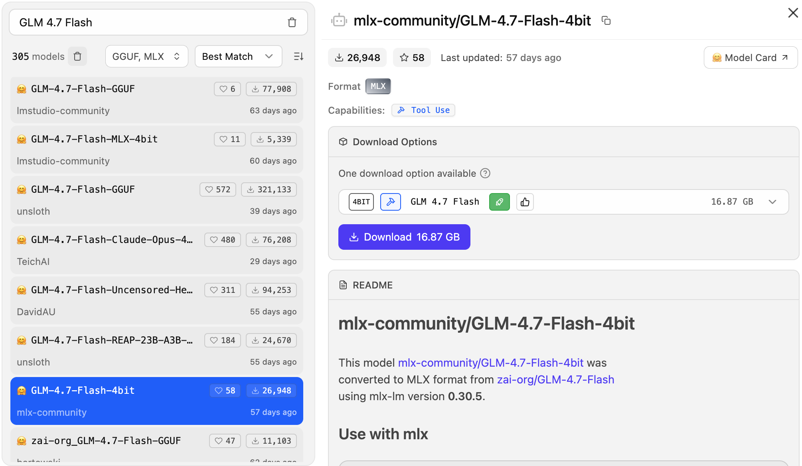
 4. Go to "Chat" on the left, select the model from the dropdown on the top, and start chatting
<br>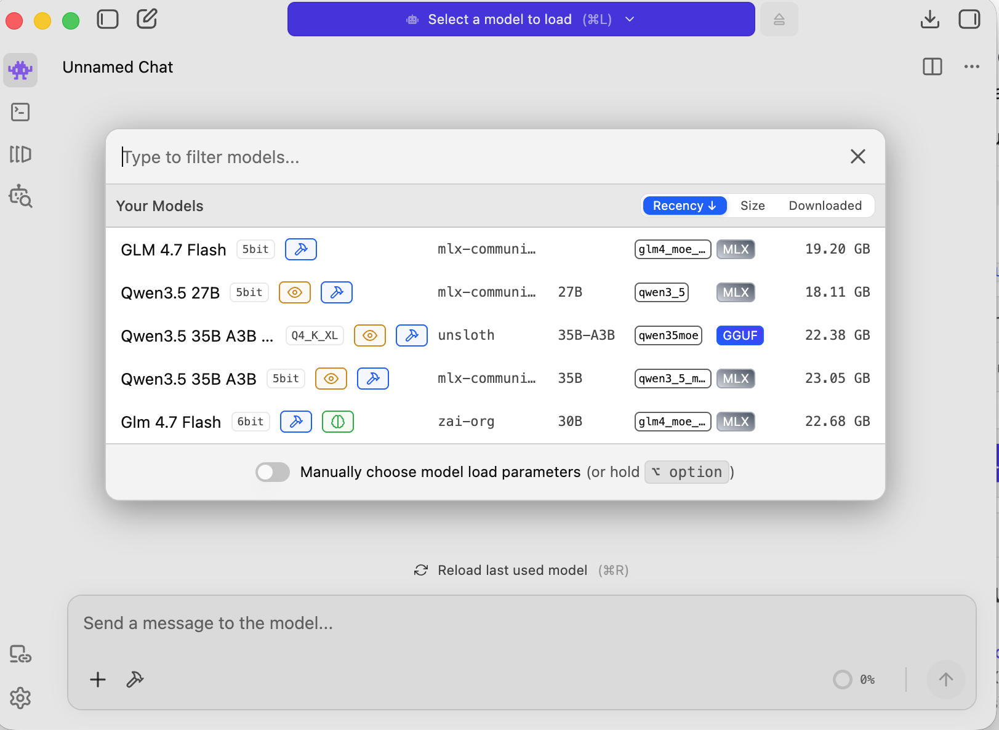

### With llama.cpp:
 1. Find the model on [HuggingFace Models portal](https://huggingface.co/models), preferably Unsloth version
 2. Choose the quant type on the right, and click on it
<br>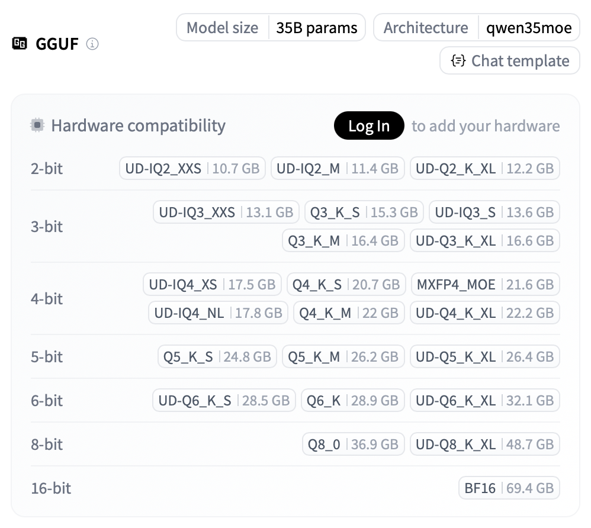
 3. Click "Use this model" dropdown and choose llama.cpp
<br>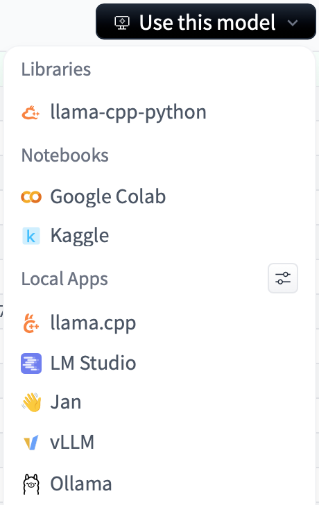
 4. On the next screen you'll see the command to launch:
   ```
   # Start a local OpenAI-compatible server with a web UI:
   llama-server -hf unsloth/Qwen3.5-35B-A3B-GGUF:Q4_K_M
   ```
 5. Go to http://localhost:8080 and chat with the model:
   <br>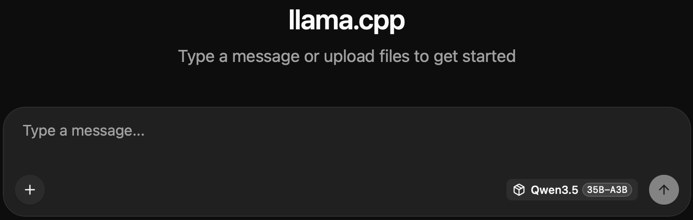

> :bulb: **Tip:** You can download a GGUF model using LM Studio and use it in both LM Studio **and** llama.cpp. In LM Studio's "My Models" tab, check the folder at the bottom (or change it for easier access). Then run:
> ```
> llama-server -m <path-to-GGUF-file>
> ```

You can now use your local model like cloud models - ask questions, write/summarize text, or write code. Results may not match larger cloud models but are still quite good.
> :bulb: **Tip:** When generating, you want the GPU at or near 100%. You can check with Activity Monitor (Window → GPU History), or with [mactop](https://github.com/metaspartan/mactop) for more detail.
> |Activity Monitor|mactop|
> | :----------------------------------------------- | :----------------------------------------------- |
> |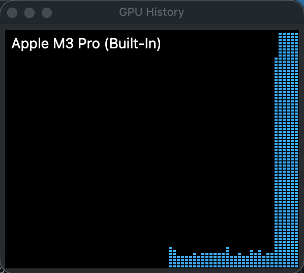|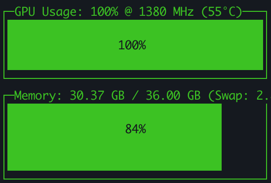|

## Config Settings
In this section I'll explain various "levers" to control model behavior and Inference Engine / API Server settings

### Context Window
This is by far the most important model parameter. This controls how much information can be sent to a model. For multi-turn conversations, all previous requests **and model responses** are sent back, so the context window can grow very large.

Context Window is measured in **tokens** - individual words or parts of words get converted to tokens. The exact algorithm belongs to the model itself, and may differ from one model to another, but for English, assuming every 3-4 characters is a token is a reasonable approximation. Tokenization for programming languages differs heavily, as well as for Chinese/Japanese.

Current SOTA cloud models context window size:
  - ChatGPT - 128K
  - Claude models (non-enterprise) - up to 200K

Local models running on LM Studio or llama.cpp can match these magnitudes. Just be aware that context window size affects memory consumption - the larger the model, the less room for context window.

How to set context window size:
 - In LM Studio: enable "Manually choose model load parameters" on the model selector dialog, then set "Context Length". The tool will show you the max content window size supported by the model.
 - In llama.cpp: Use the `-c` parameter. If you don't specify it, llama.cpp will default to the maximum size supported by the model.

### Sampling Settings
These control accuracy and "creativity" of the model responses: `temperature`, `top-k`, `top-p` and `min-p`. Check the model card on HuggingFace for recommended values for both regular question answering and coding respectively.

In LM Studio: "My Models"→ gear icon next to model → "Inference" tab:
<br>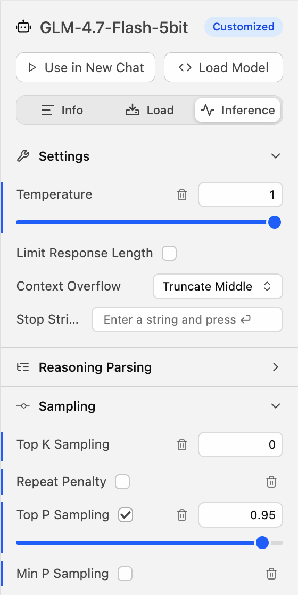

In llama.cpp: `llama-server` parameters:
```
llama-server -hf <model> --temp 0.6 --top-p 0.95 --min-p 0.01 --top-k 20
```

> :bulb: **Tip:** Some models recommend `min-p` set to `0`, but in llama.cpp `0` means "disabled". Use a small value like `0.01` instead. Similarly, `--top-p 1.0` disables `top-p` and `--top-k 0` disables `top-k`.

### Thinking Mode
All current SOTA models have a "thinking" mode where the model creates a step-by-step strategy before answering the question. You can see it in both LM Studio and llama.cpp when "Thinking..." appears in the response window.

In some cases it might be better to disable this mode, either because it takes longer for the model to answer a question or the model gives better results without it. To do that you have to modify the "chat template" your prompts are wrapped into when sent to the model.

In LM Studio: bottom of "Model Settings" → "Prompt Template" text field, add at the beginning:
```

...
```
In llama.cpp: it is a CMD line parameter: `--chat-template-args "{\"enable_thinking\":false}"`

### Flash Attention
[Flash attention](https://en.wikipedia.org/wiki/Attention_(machine_learning)#Flash_attention) is an optimization important for large contexts - it breaks the overall context into smaller, more GPU-digestable chunks. It improves attention computation speed and memory locality, but does NOT reduce prompt cache size.

In LM Studio it is enabled by default.

To enable in llama.cpp add this parameter:
```
-fa on
```

### Prompt Cache
Agents send huge prompts, but the first part is agent instructions and is always the same. **Prompt Cache** is a feature available in both LM Studio and llama.cpp which avoids reprocessing it over and over again. However, it is a little finicky and may not work for the most recent models until a new version of the inference engine drops with a fix to explicitly addressing this gap.

It is **critical** for having good agentic coding experience for this feature to work properly.

> :bulb: **Tip: Checking that Prompt Cache works**
> 1. Create a large prompt. It doesn't need to be created manually, ask the model to write a 10,000-word essay. Don't worry, you don't have to read it 😉.
> 2. Create a new chat, paste it and add "Summarize the text above in one sentence", and send.
> 3. You'll see "Processing..." in the response window for noticeable time. This is prompt processing without the cache.
> 4. Once you get the response, ask the model a follow-up question: "Now expand it to a paragraph".
> 5. If prompt cache works, barely any "Processing..." is visible the second time, because the second request is 99%+ the same as the first one, the only new thing is the follow-up question. If experience is the same as the first time, prompt caching doesn't work.

> :warning: **Warning:** As of right now, Prompt Caching doesn't work for Qwen3.5 models in LM Studio due to [this bug](https://github.com/lmstudio-ai/lmstudio-bug-tracker/issues/1563). Use llama.cpp for these models.

# Part III — Agentic Workflows
***Everything above allows you to run a model. But the real power comes when you wire it into coding agents.***

## Configuring API Servers
Agentic coding with Claude Code or Codex is all the rage right now, but it can be quite expensive in the cloud. Locally, you control not only the cost, but privacy as well.

However, agents dramatically increase:
 - Context window usage
 - Parallel requests
 - Prompt size

### Context Window for Agents
Agents put A LOT of instructions in the prompt even before you start doing anything. OpenCode uses 12K+ tokens, Claude Code uses 20K+! Add your prompt and source code on top of that. So you want at least 65K context window to get anything done, ideally 128K+. Adjust the settings accordingly.

### Parallel Requests
Claude Code in Agent Teams mode (a.k.a. "Agent Swarm") can run multiple agents in parallel, but it uses A LOT of context window memory on the API server. If your model barely fits, consider using a smaller model and leave more room for the parallel request context window.

Controlling parallel requests:
 - Only one request
   - Default in LM Studio
   - For llama.cpp specify both context window size and number of parallel requests:
     ```
     -c 131072 -np 1
     ```
 - Multiple requests
   - In LM Studio (currently an "Experimental" feature) set "Max Concurrent Predictions" in model parameters
   - For llama.cpp, you need to specify **total** context across all parallel requests. For example, if you want to allow up to 4 parallel requests, you need to multiply context window size by 4:
     ```
     -c 524288 -np 4
     ```
     > This does **not** give each agent 524K tokens. It allocates a shared 524K token pool across 4 parallel sequences.

### Tool Calling
Tool calling is where local models move from passive text generators to active execution components inside agent loops. Agents can use tools like Web Search, read/write local files, execute Bash scripts, and so on.

It is enabled by default in LM Studio, but you need to explicitly set this parameter in llama.cpp to enable it:
```
--jinja
```

### Starting API Servers
Here's an example how to start llama.cpp server with the essential parameters I discussed above:
```
llama-server -hf unsloth/Qwen3.5-35B-A3B-GGUF:Q4_K_M --jinja -fa on --temp 0.6 --top-p 0.95 --min-p 0.01 --top-k 20 -c 131072 -np 1
```

LM Studio is a desktop app at its core, but it can function as an API server as well. Go to "Developer"  tab and start the server:


Configure port, authentication, and network access in "Server Settings" if needed. Click "Load Model" and choose your model. Previously configured parameters respected by the server.

## Installing and Configuring Coding Agents
Finally, after all the architectural decisions and configuration setting it's time to get to coding agents. I'll cover 2 most popular ones.

### OpenCode
If you don't have OpenCode installed yet, follow [instructions](https://opencode.ai) to install it using your preferred method. Modify `~/.config/opencode/opencode.json` and add one of the following providers (or both) and models they host:
```json
{
  "$schema": "https://opencode.ai/config.json",
  "provider": {
    "lmstudio": {
      "npm": "@ai-sdk/openai-compatible",
      "name": "LM Studio (local)",
      "options": {
        "baseURL": "http://127.0.0.1:1234/v1"
      },
      "models": {
        "mlx-community/GLM-4.7-Flash-5bit": {
          "name": "GLM 4.7 Flash (5bit)"
        }
      }
    },
    "llama.cpp": {
      "npm": "@ai-sdk/openai-compatible",
      "name": "llama-server (local)",
      "options": {
        "baseURL": "http://127.0.0.1:8080/v1"
      },
      "models": {
        "Qwen3.5-27B": {
          "name": "Qwen3.5-27B (local)",
          "modalities": { "input": ["image", "text"], "output": ["text"] },
          "limit": {
            "context": 131072,
            "output": 32768
          }
        },
        "Qwen3.5-35B-A3B": {
          "name": "Qwen3.5-35B-A3B (local)",
          "modalities": { "input": ["image", "text"], "output": ["text"] },
          "limit": {
            "context": 131072,
            "output": 32768
          }
        }
      }
    }
  }
}
```
Start OpenCode and select your provider and model from the model drop-down.

### Claude Code
Follow [official instructions](https://code.claude.com/docs/en/overview) to install it, if needed.

Claude Code uses environment variables to point itself to the API server. One way is to set these variables right before the command, this makes it easier to switch between inference engines.

For LM Studio:
```
ANTHROPIC_BASE_URL="http://localhost:1234" ANTHROPIC_API_KEY="none" CLAUDE_CODE_AUTO_COMPACT_WINDOW=131072 claude --model glm-4.7-flash
```
For llama.cpp:
```
ANTHROPIC_BASE_URL="http://localhost:8080" ANTHROPIC_API_KEY="none" CLAUDE_CODE_AUTO_COMPACT_WINDOW=131072 claude --model unsloth/Qwen3.5-35B-A3B
```

Alternatively, set these variables in the config file `~/.claude/settings.json`. For Agents Team (a.k.a. "Agent Swarm") you have to set them in the config file to make them available to the agents when they spawn, plus you have to set some additional values:
```json
{
  "env": {
    "CLAUDE_CODE_EXPERIMENTAL_AGENT_TEAMS": "1",
    "CLAUDE_CODE_DISABLE_NONESSENTIAL_TRAFFIC": "1",
    "CLAUDE_CODE_ENABLE_TELEMETRY": "0",
    "CLAUDE_CODE_ATTRIBUTION_HEADER" : "0",
    "ANTHROPIC_BASE_URL": "http://localhost:1234",
    "ANTHROPIC_API_KEY": "none",
    "CLAUDE_CODE_AUTO_COMPACT_WINDOW": "131072"
  },
  "preferences": {
    "tmuxSplitPanes": true
  }
}
```
> :warning: **Warning:** Agent Teams use A LOT of memory on the API server ⚠️

## Loading Models Dynamically
If you switch models often, loading/ejecting them in LM Studio or restarting llama.cpp might be annoying. Fortunately, both support loading models dynamically from the OpenCode model selector or Claude Code `--model` parameter (you'd still need to restart Claude Code each time though, which would still be annoying 😒).

In LM Studio Server Settings, enable "Just-in-Time Model Loading" and that's it.

In llama.cpp, provide an `.ini` file with models and their parameters:
```ini
[Qwen3.5-35B-A3B-UD-Q4_K_XL]
model = <models-folder>/unsloth/Qwen3.5-35B-A3B-GGUF/Qwen3.5-35B-A3B-UD-Q4_K_XL.gguf
ctx-size = 131072
temp = 0.7
top-p = 0.95
min-p = 0.01
top-k = 20
```
Start llama.cpp with `--models-preset <ini-file-path>` instead of `-hf` or `-m` parameter. Keep the **server** parameters (those not in the `.ini` file) in the start command.

# Closing Thoughts
***Local AI on a Mac is no longer a toy experiment. With the right architectural choices — especially around quantization, context window sizing, and prompt caching — it becomes a viable daily driver for advanced workflows.***

The result may not match trillion-parameter cloud models, but it is surprisingly capable — and entirely under your control.
